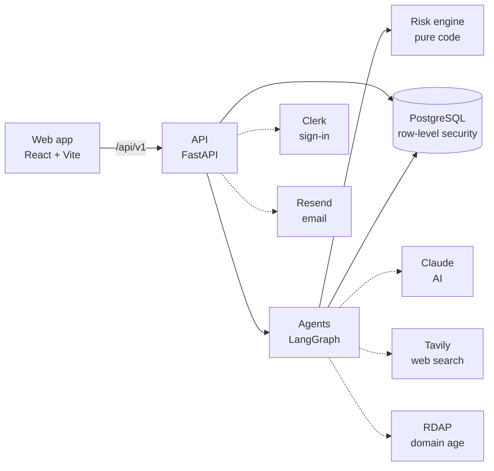

# Probity

**Evidence before payment.**

Small businesses pay invoices every day, and a single changed bank account or copied invoice can cost them dearly. Probity investigates
each invoice before you pay it. It reads the invoice, compares it with your own records (vendors, verified bank accounts, past invoices,
purchase orders) and with outside sources, and shows you the evidence for every concern it finds. A pure-code risk engine turns verified
findings into a score. Low-risk invoices can be cleared automatically; anything unusual is held for a person to decide, with the reasons.

> **The AI can investigate, but it cannot change the risk score.** Agents find signals, every claim needs evidence, code computes the
> score, and a human decides the payment.

## Who it's for

- **The accounts person (accountant):** uploads invoices, keeps the vendor list and past invoices up to date, and fixes misread fields.
- **The approver:** reviews held invoices, approves or rejects with a reason, and confirms changes with the vendor through a channel already on file.
- **The vendor:** never logs in. They may get a short, neutral email asking them to confirm details, sent only after an approver approves it.

## How a real invoice flows

1. **Upload.** The accountant uploads a PDF or an emailed invoice. Probity reads the fields: vendor, GSTIN, invoice number, dates,
   amounts and bank account.
2. **Investigate.** Agents check, among other things:
   - Is this a vendor we know?
   - Is this the bank account we verified for them?
   - Is the price normal for them?
   - Have we seen this invoice before?
   - Does it match the purchase order?
   - How old is the sender's web domain?
   - Is there anything public about them?
3. **Verify.** Every finding must point to evidence: the invoice value and the record it was compared with. Findings without evidence are dropped.
4. **Score.** Pure code adds up the verified findings into a 0 to 100 score: LOW, MEDIUM, HIGH or CRITICAL.
5. **Gate.** If everything checked out, the invoice is cleared. If anything is unusual, or a required check **could not be verified**, it's
   held for a person, who sees exactly why.
6. **Decide.** The approver approves, rejects, asks the vendor to confirm, or asks for a deeper investigation. Probity recommends; it
   never pays and never accuses anyone.
7. **Remember.** The outcome is saved, and the vendor's next invoice is checked with that history in mind.

## Design rules

- **The AI investigates; pure code computes the risk score.** The risk engine has no AI input and no way for text to change a number.
- **Every claim needs evidence.** No evidence means no claim. Unverified findings add zero points.
- **"Could not verify" is never "fine".** When a check can't run (missing key, no history, network failure), Probity says so, adds no
  points, and holds the invoice if the check was required. It never invents a result.
- **The system never pays anything.** It recommends; people decide.
- **A human always decides** anything that isn't clearly low-risk. Large or critical cases need two approvers.
- **Vendor replies stay unverified** until an approver confirms them through a channel already on file (a known phone number, a bank letter,
  in person), never through details from the email itself.
- **Neutral wording.** Probity reports *anomalies* and *recommends a hold*. It never calls anything "fraud".

## Architecture



Agents in order: document reader → planner → vendor investigator + transaction analyst → web researcher (when needed) → evidence verifier
→ risk engine → case analyst → policy gate. Details: [docs/Architecture.md](docs/Architecture.md).

## Quick start

You need Git, Python 3.12+, Node 22, Docker Desktop, an Anthropic API key and a free Clerk development app. On Windows:

```powershell
git clone https://github.com/sujalmallick/probity-ai.git
cd probity-ai
powershell -ExecutionPolicy Bypass -File scripts\dev.ps1
```

The first run sets things up and tells you which keys to add. Add them and run it again, then open http://localhost:5180.

**Full step-by-step guide (Windows, macOS, Linux):** [docs/SETUP.md](docs/SETUP.md). **Getting the keys:** [docs/API_KEYS.md](docs/API_KEYS.md).

## Current status

Probity is a **hackathon prototype**. It works end to end on real data, but it hasn't been audited for production use.

**Working**
- Upload text-based PDFs, emailed invoices (.eml) and text files.
- The full agent pipeline, with "could not verify" handling and labelled fallbacks when the AI is unavailable.
- The risk score with evidence for every point, auto-clear rules, approvals (including two-approver cases) and written reasons.
- Vendor list with verified bank accounts, domains and contacts; CSV import of vendors, past invoices and purchase orders.
- Neutral vendor emails (Resend, allowlist while testing), vendor replies, out-of-band confirmation.
- Roles (viewer, accountant, approver, owner), case memory, audit log, PDF/JSON export, and workspace isolation in the database.

**Planned / not yet supported**
- **Scanned PDFs and photos:** refused today. There's no OCR.
- **GST registry verification:** there's no free official API. Probity checks the GSTIN's format and checksum only, and shows the registry
  status as "could not verify". You can record what you saw on the GST portal by hand; it's labelled "Entered manually".
- **Email providers other than Resend** (no SMTP); bounce and out-of-office handling for vendor replies.
- **Screens for some API features:** notifications, adding single past invoices and POs, the invoice-risk policy.
- **Frontend tests and a linter.**
- **Data retention and deletion** policy.

**Known limitations**
- Without approved history, verified bank accounts and a Tavily key, many checks say "could not verify", so a new workspace holds most invoices.
- Non-INR invoices are held, because prices can't be compared.
- A background worker (Redis + Celery) is optional. By default investigations run inside the API process, which is fine for one machine.
- Running the whole stack with `make up` builds a web image without a Clerk key, so sign-in is unavailable there. Use the setup guide instead.

Full list: [docs/FEATURES.md](docs/FEATURES.md).

## Documentation

| Doc | What it's for |
|---|---|
| [docs/SETUP.md](docs/SETUP.md) | Install and run it, step by step, with troubleshooting |
| [docs/API_KEYS.md](docs/API_KEYS.md) | Every key and service: required or optional, cost, where it goes |
| [docs/FEATURES.md](docs/FEATURES.md) | What works, what's partial, what's planned, plus ideas to work on |
| [docs/Architecture.md](docs/Architecture.md) | How the code is organised, for contributors |
| [docs/Guardrails.md](docs/Guardrails.md) | The safety rules and how they're enforced |
| [docs/DECISIONS.md](docs/DECISIONS.md) | Design decisions and current limits |
| [docs/API_CONTRACT.md](docs/API_CONTRACT.md) | The API the web app uses |
| [docs/PRD.md](docs/PRD.md) | The original product requirements (some parts describe the earlier demo version) |

## Contributing

Friends and newcomers are welcome. Start with [CONTRIBUTING.md](CONTRIBUTING.md): it has starter tasks, the workflow, and the checks to
run before a pull request. To report a security problem privately, see [SECURITY.md](SECURITY.md).

## License

No license has been chosen yet. Until one is added, the code is not licensed for reuse.

---

Probity identifies anomalies and recommends a hold. It never executes payments and never makes accusations.
