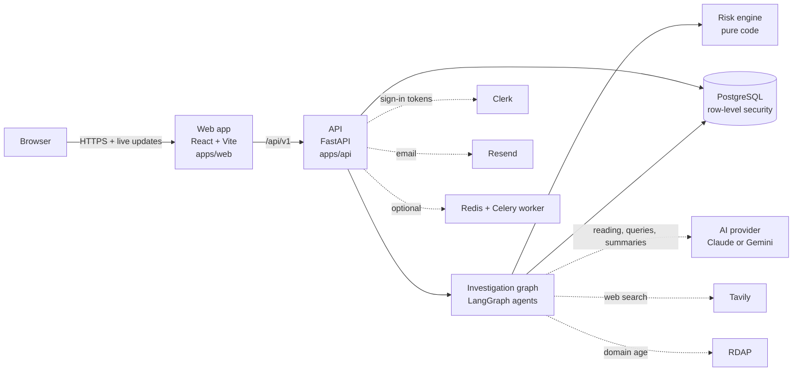
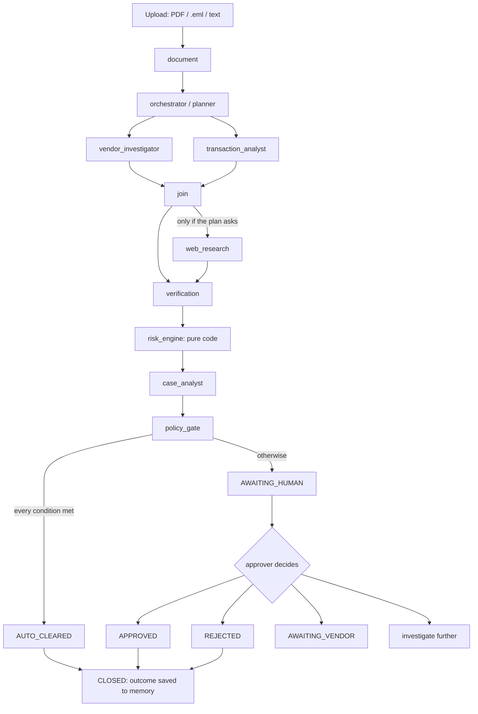
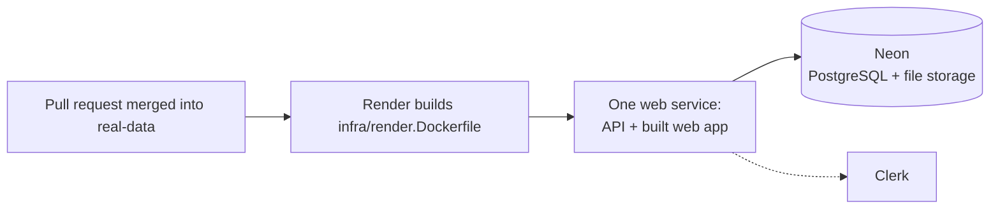

# Probity architecture (for contributors)

A short map of how Probity is put together, so you know where to look before changing something. For what each feature does, see
[FEATURES.md](FEATURES.md). For the safety rules behind the design, see [Guardrails.md](Guardrails.md) and [DECISIONS.md](DECISIONS.md).

## The big picture

One rule shapes everything: **the AI can investigate, but it cannot change the risk score.** Agents produce *claims*. Each claim must
carry *evidence* and pass *verification*. Pure code turns verified claims into a score. A *policy gate* decides whether a person must look.
A *human* decides about the payment. Probity never pays anything.

## Folder map

| Folder | What's in it |
|---|---|
| `apps/api/` | The backend: Python 3.12+, FastAPI, SQLAlchemy, Alembic, LangGraph. Settings live in `apps/api/.env`. |
| `apps/api/src/probity/api/` | HTTP endpoints. `main.py` (cases, documents, decisions, team, policy), `vendors.py`, `workspace.py` (config, onboarding, imports, notes, notifications), `records.py` (past invoices and POs), `risk.py` (policy-driven second view), `deps.py` (auth and rate limits), `limits.py` (body size). |
| `apps/api/src/probity/agents/` | The investigation steps, one file each (see the table below). |
| `apps/api/src/probity/graph/build.py` | Wires the agents into a LangGraph graph, with retries and "partial" handling. |
| `apps/api/src/probity/risk/engine.py` | **The risk engine.** Weights, tiers, scoring. Pure code, no AI. |
| `apps/api/src/probity/risk/` (other files) | The policy-driven second view (`invoice_scoring.py`, `case_scoring.py`, `narrate.py`, `invoice_policy.example.json`). |
| `apps/api/src/probity/signals/detectors.py` | The deterministic checks (bank change, duplicate, price anomaly, PO, dates, …) as pure functions. |
| `apps/api/src/probity/evidence/` | The claim/evidence model and the verifier (cite-or-drop, recomputing numbers, quote checks). |
| `apps/api/src/probity/ingestion/` | Reading uploads: file-type sniffing, PDF/email/text extraction, field parser, validators, PDF cleaning (rewrite without active content), optional virus scan, isolated parsing. |
| `apps/api/src/probity/guardrails/` | Encryption and masking of account numbers (`crypto.py`); prompt-injection detection, redaction and neutral-language rules (`text.py`). |
| `apps/api/src/probity/llm/` | The single gateway to the AI provider (`client.py`): Anthropic or Gemini, chosen by `LLM_PROVIDER`. Also the versioned prompts (`prompts/`). |
| `apps/api/src/probity/tools/` | Outside lookups: safe web fetch (SSRF protection), Tavily search, RDAP domain age, usage budgets. |
| `apps/api/src/probity/db/` | Database models, sessions (sets the workspace for row-level security), the audit hash chain, migrations. |
| `apps/api/src/probity/` (top-level files) | `config.py` (settings and start-up checklist), `bootstrap.py` (create/upgrade the schema), `check.py` (live integration checks), `services.py` (case lifecycle, decisions, emails), `auth.py` (Clerk), `mailer.py`, `notify.py`, `importer.py` (CSV), `baseline.py`, `sanity.py`, `trace.py`, `report.py` (PDF export), `worker.py` (Celery), `observability.py`, `storage.py`. |
| `apps/api/tests/` | The backend test suite. Test data is built by `tests/factories/`. |
| `apps/web/` | The frontend: React 18, Vite, TypeScript, Tailwind, Clerk. Pages in `src/pages/`, shared pieces in `src/components/`, API client and helpers in `src/lib/`. |
| `infra/` | Docker: `docker-compose.dev.yml` (PostgreSQL for development, plus optional Redis), `docker-compose.yml` (the production stack with worker, scheduler and a Cloudflare Tunnel; settings in `infra/.env.prod`, guide in `infra/cloudflare/`), Dockerfiles, nginx config, `postgres/` (creates the `probity_app` database user). Also `render.Dockerfile` and `render/` (the live Render deployment); `render.yaml` is at the repo root. |
| `scripts/dev.ps1` | One-command local start on Windows. |
| `Makefile` | The same tasks for macOS/Linux (`make install`, `db`, `bootstrap`, `api`, `web`, `dev`, `test`, …). |
| `benchmark/real/` | A harness to run Probity on **your own** invoices against your own labels. The invoices, labels and reports folders are git-ignored and never committed. |
| `docs/` | These docs, plus the product and safety specs (PRD, Guardrails, Security, Decisions, API contract, failure audit). |

## The life of one case

1. **Upload** (`POST /api/v1/documents`). The file is checked: size, real file type, scans and images refused, duplicates. PDFs are rewritten
   without active content (hostile ones refused), a virus scan runs if configured, and only the clean copy is stored.
2. **Create a case** (`POST /api/v1/cases`). The case runs inline in the API process by default, or on a Celery worker if
   `TASK_BACKEND=celery`. Status moves QUEUED → EXTRACTING → INVESTIGATING → VERIFYING → SCORING.
3. **Agents** add **claims**, each with **evidence**: what the invoice says vs. what your records say. A check that can't run is recorded
   as **"could not verify"** with a reason, and adds no points.
4. **Verification** keeps a claim only if its evidence supports it, recomputing numbers and quotes in code. Claims without evidence are dropped.
5. The **risk engine** adds up the points of verified claims only. The **case analyst** explains the result in plain English but can't
   change it.
6. The **policy gate** auto-clears only if every condition holds (see [FEATURES.md](FEATURES.md#4-could-not-verify-and-auto-clear)).
   Otherwise the case waits for a person.
7. A person **decides**: approve, reject, request verification, or investigate further. An optional email to the vendor goes out only after
   an approver sends it. Vendor replies stay unverified until an approver confirms them out-of-band.
8. **Closing** the case records the outcome in **case memory**, which the next invoice from that vendor sees.

The web app follows along live through server-sent events (`GET /api/v1/cases/{id}/events`). Every step is written to the audit log.

### Where each agent lives

| Step | File | Uses the AI? |
|---|---|---|
| Document reader | `agents/document.py` | Only to fill missing fields; its value must appear word for word in the document |
| Planner (orchestrator) | `agents/orchestrator.py` | No |
| Vendor investigator | `agents/vendor.py` | No |
| Transaction analyst | `agents/transaction.py` (checks in `signals/detectors.py`) | No |
| Web researcher | `agents/web.py` | To write search queries (falls back to standard queries) |
| Evidence verifier | `agents/verification.py` + `evidence/verifier.py` | Only to check that a quoted source supports a claim |
| Risk engine | `risk/engine.py` (called from `agents/risk_case.py`) | **Never** |
| Case analyst and policy gate | `agents/risk_case.py` | Analyst writes the summary; the gate is pure code |
| Action (drafts, vendor replies) | `agents/action.py` | Drafts and reply reading, with labelled rule-based fallbacks |

**Rule:** if the AI is unavailable, every step still finishes, using rules instead, and labels the result "rule-based fallback, AI unavailable".

## Database and migrations

- **PostgreSQL only.** There are two database users:
  - `DATABASE_MIGRATE_URL` (the schema owner) runs migrations.
  - `DATABASE_URL` is what the app uses. It's the `probity_app` user, which **cannot bypass row-level security**.
- **Row-level security.** Every workspace-owned table has a policy that only shows rows for the current workspace. The app sets that
  workspace at the start of each transaction (`db/session.py`). The audit log and evidence can't be edited or deleted (database triggers).
- **Migrations** use Alembic and live in `apps/api/src/probity/db/migrations/versions/` (`0001_…`, `0002_…`, …). There's no
  `alembic.ini`. Use the project's commands, from `apps/api`:
  - `python -m probity.bootstrap`: create or upgrade the schema to the latest migration.
  - `python -m probity.bootstrap --reset --yes`: wipe and recreate (development only; refused when `ENV=prod`).
  - `python -m probity.db.migrate revision -m "short description"`: generate a new migration from model changes. Then read and fix it
    by hand, and make sure `downgrade()` really reverses `upgrade()`.
- The API **refuses to start** if the database isn't at the latest migration.
- `bootstrap` only creates the schema. **It never inserts data**: users come from Clerk sign-in, and everything else is entered by them.

## How the tests work

- Location: `apps/api/tests/`. Run with `python -m pytest -q` from `apps/api` (see [SETUP.md](SETUP.md#9-run-the-tests)).
- **Throwaway database:** `conftest.py` connects to PostgreSQL with `TEST_POSTGRES_ADMIN_URL`, creates the `probity_app` user if needed and
  a fresh `probity_test_<random>` database, runs the migrations, and drops it at the end. Tables are emptied between tests. Row-level security
  is on, as in real use.
- **Factories, not fixtures files:** `tests/factories/` builds workspaces, users, vendors, history, POs and invoice PDFs in code
  (`build_world()`, `clean_spec()`, `bank_change_spec()`, …). There's no seed data anywhere in the app.
- **Fakes only in tests:** `conftest.py` replaces the AI, RDAP, web search and page fetching, email and Clerk with in-memory fakes, and
  ignores your `apps/api/.env`. The app has **no switch** for this, so tests never use your keys.
- **Safety tests** cover the Guardrails: injection, made-up results, overclaiming, SSRF, personal data, auto-clear abuse, loops and
  spoofed replies. See `test_safety_eval.py`, `test_could_not_verify.py`, `test_secret_leaks.py`, `test_masking.py`, `test_sod_mfa.py`
  and `test_autoclear_gate.py`.
- **Frontend:** no unit tests or linter yet. `npm run typecheck` and `npm run build` are the checks.

## Deployment

The live app (https://probity-3xgk.onrender.com) is deployed from the **`real-data`** branch. Every push to it triggers a new deploy.

- **One container on Render's free plan** serves the API and the built web app from the same address, so there's no proxy and no CORS.
  It's configured by `render.yaml` and `infra/render.Dockerfile`.
- **Investigations run inside that process** (`TASK_BACKEND=inline`), so there must be **exactly one instance**: no worker, scheduler
  or Redis.
- **Every start runs the migrations** against the production database. So:
  - a new migration must work on real data;
  - it must also grant access to the `probity_app` user (as `0004`/`0005` do), or the app gets "permission denied";
  - a new **required** setting must be added in Render's Environment page **before** the code that needs it is merged.
- **Live settings and keys** live in Render's dashboard, never in the repo.
- **The free plan sleeps** after 15 minutes without visitors, and the next visit takes about a minute.
- Full guide and free-tier limits: [infra/render/README.md](../infra/render/README.md). A self-hosted Docker + Cloudflare alternative is
  in [infra/cloudflare/README.md](../infra/cloudflare/README.md).

## No mock or demo mode

There is **no mock, demo, offline or cached mode in the app code**. That includes no fake AI switch, no seeded demo workspace and no
recorded replies. `config.py` says so, and tests fail if such settings or routes reappear (`test_auth.py`, `test_could_not_verify.py`).

When something isn't available, Probity says **"could not verify"** and holds the invoice if that check was required. It never fakes a
result. Fakes exist only inside `apps/api/tests/`. Please keep it that way.
